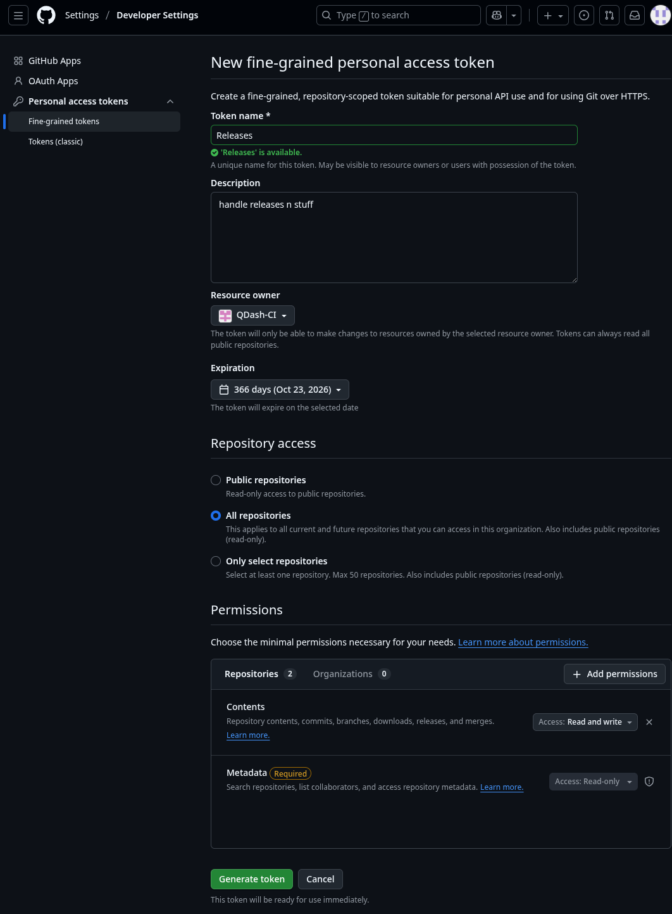
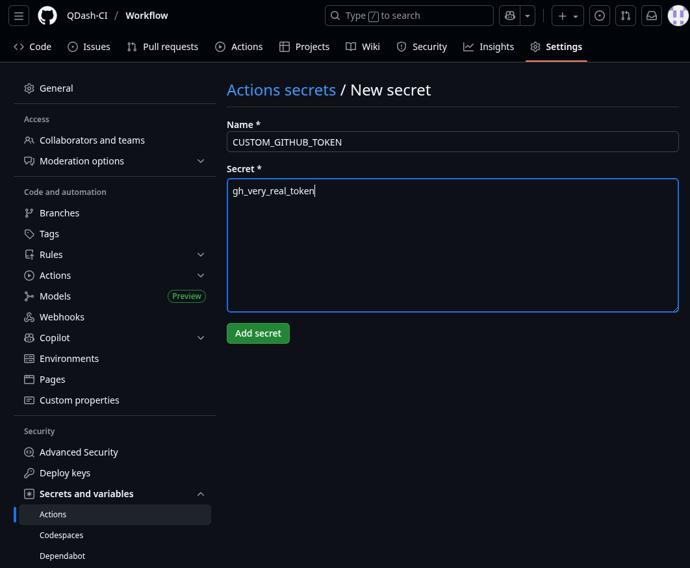
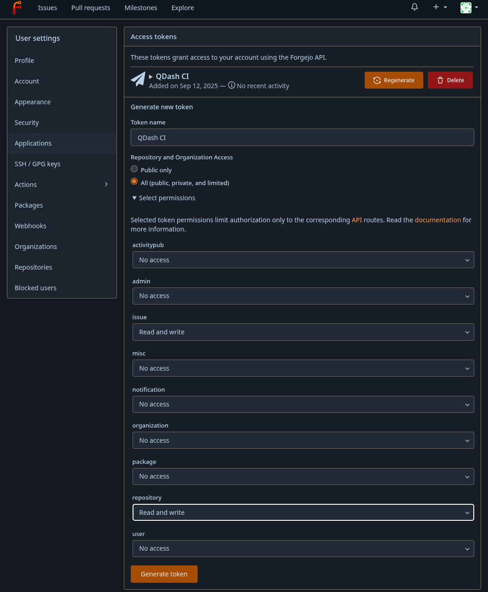

# Setup

This workflow setup *requires* at least three things:
<!-- TOC -->
- [Repositories](#repositories)
- [Tokens](#tokens)
    - [GitHub](#github)
    - [Forgejo](#forgejo)
- [Webhook](#webhook)
<!-- /TOC -->

## Repositories

To start, you must have repositories to store builds. Right now, these MUST be GitHub, but eventually support for Forgejo and other hosts will be added.

You're recommended to create an organization specifically for this workflow, *plus* individual repositories for each type: PR, Master, and Release. In the future, Nightly and Continuous test builds will be separate as well.

Once done, edit the corresponding entries in `.ci/release.json`.

## Tokens

### GitHub

You *must* have a custom GitHub token defined, or else all releases will fail.

If your releases and PR/Master builds are all hosted in the same organization, you can make a fine-grained access token for your organization. To do so, go to `Settings -> Developer Settings -> Personal Access Tokens -> Fine-grained tokens`. From there, create a new fine-grained token with a proper name and description, and set the resource owner to your organization. Optionally, you may choose to restrict its access to the release repos.

As for permissions, they should only need `Contents: Read and Write`.

Now generate your token and store it... SECURELY... via `pass` or similar.

From here, save it as a secret in your organization or workflow repo as `CUSTOM_GITHUB_TOKEN`:

### Forgejo

The workflow is currently defined to work *exclusively* with Forgejo. Technically, it can work with GitLab or even GitHub itself, but this is strongly discouraged for many reasons:
- Its scripts assume the use of Forgejo
- GitHub is proprietary and run by Microsoft
- GitLab has terrible UX for this type of automation
- fj2ghook is, well, for Forgejo only

Because of this, some of the scripts in here send requests to your configured Forgejo instance. Forgejo's API generally prefers to work with API tokens, and this is needed regardless if you wish to sync status with your instance. To do so:
- Go to `Settings -> Applications` in your instance
- Give your token a descriptive name
- Set `issue` and `repository` to `Read and write`

Like GitHub, generate your token and store it SECURELY. This will be stored under `FORGEJO_TOKEN`.

The user of the token must also have access to the target repository or repositories. Using your personal account is fine, but a separate account is recommended.

## Webhook

The workflow interacts with Forgejo via a webhook. See [fj2ghook](https://git.crueter.xyz/crueter/fj2ghook) for info on setup and such.

Note that fj2ghook is a security nightmare because I whipped it up in a grand total of 5 minutes using esoteric knowledge of Flask from when I was 12 years old and thus had 0 desire to implement even the slightest bit of security. Check the repo occasionally for updates to see if I fix it or not, or if I decide to rewrite it in a different language for no good reason.